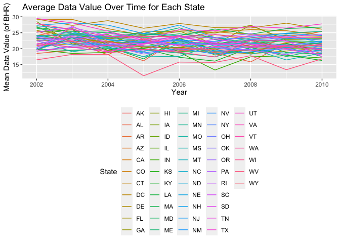
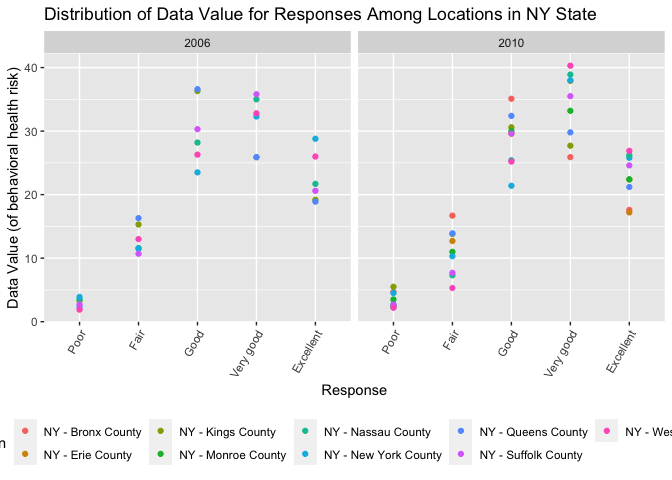
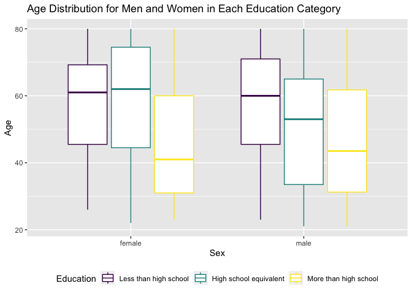

p8105_hw3_rx2236
================
Ruiqi Xue
2023-10-11

``` r
library(tidyverse)
```

    ## ── Attaching core tidyverse packages ──────────────────────── tidyverse 2.0.0 ──
    ## ✔ dplyr     1.1.3     ✔ readr     2.1.4
    ## ✔ forcats   1.0.0     ✔ stringr   1.5.0
    ## ✔ ggplot2   3.4.3     ✔ tibble    3.2.1
    ## ✔ lubridate 1.9.3     ✔ tidyr     1.3.0
    ## ✔ purrr     1.0.2     
    ## ── Conflicts ────────────────────────────────────────── tidyverse_conflicts() ──
    ## ✖ dplyr::filter() masks stats::filter()
    ## ✖ dplyr::lag()    masks stats::lag()
    ## ℹ Use the conflicted package (<http://conflicted.r-lib.org/>) to force all conflicts to become errors

``` r
library(ggridges)
library(patchwork)
```

## Problem 1

``` r
library(p8105.datasets)
data("instacart")
```

``` r
instacart = 
  instacart |> 
  as_tibble()
```

This dataset contains 1384617 rows and 15 columns, with each row
resprenting a single product from an instacart order. Variables include
identifiers for user, order, and product; the order in which each
product was added to the cart. There are several order-level variables,
describing the day and time of the order, and number of days since prior
order. Then there are several item-specific variables, describing the
product name (e.g. Yogurt, Avocado), department (e.g. dairy and eggs,
produce), and aisle (e.g. yogurt, fresh fruits), and whether the item
has been ordered by this user in the past. In total, there are 39123
products found in 131209 orders from 131209 distinct users.

Below is a table summarizing the number of items ordered from aisle. In
total, there are 134 aisles, with fresh vegetables and fresh fruits
holding the most items ordered by far.

``` r
instacart |> 
  count(aisle) |> 
  arrange(desc(n))
```

    ## # A tibble: 134 × 2
    ##    aisle                              n
    ##    <chr>                          <int>
    ##  1 fresh vegetables              150609
    ##  2 fresh fruits                  150473
    ##  3 packaged vegetables fruits     78493
    ##  4 yogurt                         55240
    ##  5 packaged cheese                41699
    ##  6 water seltzer sparkling water  36617
    ##  7 milk                           32644
    ##  8 chips pretzels                 31269
    ##  9 soy lactosefree                26240
    ## 10 bread                          23635
    ## # ℹ 124 more rows

Next is a plot that shows the number of items ordered in each aisle.
Here, aisles are ordered by ascending number of items.

``` r
instacart |> 
  count(aisle) |> 
  filter(n > 10000) |> 
  mutate(aisle = fct_reorder(aisle, n)) |> 
  ggplot(aes(x = aisle, y = n)) + 
  geom_point() + 
  labs(title = "Number of items ordered in each aisle") +
  theme(axis.text.x = element_text(angle = 60, hjust = 1))
```

<!-- -->

Our next table shows the three most popular items in aisles
`baking ingredients`, `dog food care`, and `packaged vegetables fruits`,
and includes the number of times each item is ordered in your table.

``` r
instacart |> 
  filter(aisle %in% c("baking ingredients", "dog food care", "packaged vegetables fruits")) |>
  group_by(aisle) |> 
  count(product_name) |> 
  mutate(rank = min_rank(desc(n))) |> 
  filter(rank < 4) |> 
  arrange(desc(n)) |>
  knitr::kable()
```

| aisle                      | product_name                                  |    n | rank |
|:---------------------------|:----------------------------------------------|-----:|-----:|
| packaged vegetables fruits | Organic Baby Spinach                          | 9784 |    1 |
| packaged vegetables fruits | Organic Raspberries                           | 5546 |    2 |
| packaged vegetables fruits | Organic Blueberries                           | 4966 |    3 |
| baking ingredients         | Light Brown Sugar                             |  499 |    1 |
| baking ingredients         | Pure Baking Soda                              |  387 |    2 |
| baking ingredients         | Cane Sugar                                    |  336 |    3 |
| dog food care              | Snack Sticks Chicken & Rice Recipe Dog Treats |   30 |    1 |
| dog food care              | Organix Chicken & Brown Rice Recipe           |   28 |    2 |
| dog food care              | Small Dog Biscuits                            |   26 |    3 |

Finally is a table showing the mean hour of the day at which Pink Lady
Apples and Coffee Ice Cream are ordered on each day of the week. This
table has been formatted in an untidy manner for human readers. Pink
Lady Apples are generally purchased slightly earlier in the day than
Coffee Ice Cream, with the exception of day 5.

``` r
instacart |>
  filter(product_name %in% c("Pink Lady Apples", "Coffee Ice Cream")) |>
  group_by(product_name, order_dow) |>
  summarize(mean_hour = mean(order_hour_of_day)) |>
  pivot_wider(
    names_from = order_dow, 
    values_from = mean_hour) |>
  knitr::kable(digits = 2)
```

    ## `summarise()` has grouped output by 'product_name'. You can override using the
    ## `.groups` argument.

| product_name     |     0 |     1 |     2 |     3 |     4 |     5 |     6 |
|:-----------------|------:|------:|------:|------:|------:|------:|------:|
| Coffee Ice Cream | 13.77 | 14.32 | 15.38 | 15.32 | 15.22 | 12.26 | 13.83 |
| Pink Lady Apples | 13.44 | 11.36 | 11.70 | 14.25 | 11.55 | 12.78 | 11.94 |

## Problem 2

Import data

``` r
library(p8105.datasets)
data("brfss_smart2010")
```

Clean the dataset

``` r
brfss_smart2010 =
  brfss_smart2010 |> 
  as_tibble() |>
  janitor::clean_names() |>
  rename("location_abbr" = "locationabbr") |>
  rename("location_desc" = "locationdesc")

brfss_oh = 
  filter(brfss_smart2010, topic == "Overall Health")
```

Check values of `response`

``` r
print(unique(pull(brfss_oh, response)))
```

    ## [1] "Excellent" "Very good" "Good"      "Fair"      "Poor"

Keep cleaning the data

``` r
brfss_oh = 
  filter(brfss_oh, response == "Excellent" |
           response == "Very good" |
           response == "Good" |
           response == "Fair" |
           response == "Poor") |>
  mutate(response = factor(response, levels = c("Poor", "Fair", "Good", "Very good", "Excellent"),
                         ordered = TRUE))
```

Check which states were observed at 7 or more locations in 2002 and
2010.

``` r
county_2002 = brfss_oh |>  
  filter(year == 2002) |> 
  group_by(location_abbr, location_desc) |> 
  summarise()
```

    ## `summarise()` has grouped output by 'location_abbr'. You can override using the
    ## `.groups` argument.

``` r
county_2002 = county_2002 |> 
  group_by(location_abbr) |> 
  summarise(count = n()) |> 
  filter(count >=7) 

print(county_2002)
```

    ## # A tibble: 6 × 2
    ##   location_abbr count
    ##   <chr>         <int>
    ## 1 CT                7
    ## 2 FL                7
    ## 3 MA                8
    ## 4 NC                7
    ## 5 NJ                8
    ## 6 PA               10

The states that were observed at 7 or more locations in 2002 are: CT,
FL, MA, NC, NJ, PA.

``` r
county_2010 = brfss_oh |>  
  filter(year == 2010) |> 
  group_by(location_abbr, location_desc) |> 
  summarise()
```

    ## `summarise()` has grouped output by 'location_abbr'. You can override using the
    ## `.groups` argument.

``` r
county_2010 = county_2010 |> 
  group_by(location_abbr) |> 
  summarise(count = n()) |> 
  filter(count >=7) 

print(county_2010)
```

    ## # A tibble: 14 × 2
    ##    location_abbr count
    ##    <chr>         <int>
    ##  1 CA               12
    ##  2 CO                7
    ##  3 FL               41
    ##  4 MA                9
    ##  5 MD               12
    ##  6 NC               12
    ##  7 NE               10
    ##  8 NJ               19
    ##  9 NY                9
    ## 10 OH                8
    ## 11 PA                7
    ## 12 SC                7
    ## 13 TX               16
    ## 14 WA               10

Similarly, we get states that were observed at 7 or more locations in
2010: CA, CO, FL, MA, MD, NC, NE, NJ, NY, OH, PA, SC, TX, WA.

Now make a “spaghetti” plot of average data value over time within a
state.

``` r
excellent_df = brfss_oh |> 
  filter(response == "Excellent") |> 
  select(location_abbr, year, data_value)

excellent_df = excellent_df |> 
  group_by(location_abbr, year) |> 
  summarise(mean_value = mean(data_value)) |> 
  rename(state = location_abbr)
```

    ## `summarise()` has grouped output by 'location_abbr'. You can override using the
    ## `.groups` argument.

``` r
excellent_df |> 
  ggplot(aes(x = year, y = mean_value, color = state)) +
  geom_line() + 
  theme(legend.position = "bottom") +
  labs(
    title = "'Spaghetti' Plot of Average Data Value Over Time for Each State",
    x = "Year",
    y = "Mean Data Value (of BHR)",
    color = "State"
  ) 
```

    ## Warning: Removed 3 rows containing missing values (`geom_line()`).

<!-- -->

Now, make the two-panel plot showing for the years 2006 and 2010, the
distribution of `data_value` for responses (“Poor” to “Excellent”) among
locations in NY State.

``` r
NY_response = 
  brfss_oh |> 
  filter(year == 2006 | year == 2010, location_abbr == "NY") |> 
  select(location_desc, response, data_value, year) 

NY_response |>
  ggplot(aes(x = response, y = data_value, color = location_desc)) + 
  geom_point() +
  theme(legend.position = "bottom") +
  theme(axis.text.x = element_text(angle = 60, hjust = 1)) +
  facet_grid(~year) +
  labs(
    title = "Distribution of Data Value for Responses Among Locations in NY State",
    x = "Response",
    y = "Data Value (of behavioral health risk)",
    color = "Location"
  ) 
```

<!-- -->

## Problem 3

First, clean the datasets and merge them into one dataset.

``` r
demographic_df = read_csv("data/nhanes_covar.csv", skip = 4) |>
  janitor::clean_names() |>
  mutate(
    sex = case_match(
      sex,
      1 ~ "male",
      2 ~ "female")) |>
  mutate(
    education = case_match(
      education,
      1 ~ "Less than high school",
      2 ~ "High school equivalent",
      3 ~ "More than high school"
    )) |>
  mutate(education = factor(education, levels = c("Less than high school", "High school equivalent", "More than high school"), ordered = TRUE)) |>
  drop_na() |>
  filter(age >= 21)
```

    ## Rows: 250 Columns: 5
    ## ── Column specification ────────────────────────────────────────────────────────
    ## Delimiter: ","
    ## dbl (5): SEQN, sex, age, BMI, education
    ## 
    ## ℹ Use `spec()` to retrieve the full column specification for this data.
    ## ℹ Specify the column types or set `show_col_types = FALSE` to quiet this message.

``` r
accel_df = 
  read_csv("data/nhanes_accel.csv") |>
  janitor::clean_names() |>
  drop_na()
```

    ## Rows: 250 Columns: 1441
    ## ── Column specification ────────────────────────────────────────────────────────
    ## Delimiter: ","
    ## dbl (1441): SEQN, min1, min2, min3, min4, min5, min6, min7, min8, min9, min1...
    ## 
    ## ℹ Use `spec()` to retrieve the full column specification for this data.
    ## ℹ Specify the column types or set `show_col_types = FALSE` to quiet this message.

``` r
merged_df = left_join(demographic_df, accel_df)
```

    ## Joining with `by = join_by(seqn)`

``` r
merged_df2 = merged_df |>
  pivot_longer(
    min1:min1440,
    names_to = "minute",
    values_to = "mims_value"
  ) 
```

Produce a table for the number of men and women in each education
category.

``` r
merged_df |> 
  group_by(sex, education) |> 
  summarise(n = n()) |>
  pivot_wider(
    names_from = sex,
    values_from = n) |>
  knitr::kable()
```

    ## `summarise()` has grouped output by 'sex'. You can override using the `.groups`
    ## argument.

| education              | female | male |
|:-----------------------|-------:|-----:|
| Less than high school  |     28 |   27 |
| High school equivalent |     23 |   35 |
| More than high school  |     59 |   56 |

Through the table we can see in “high school equivalent” category the
number of female is significantly less than male while in the other two
categories there are slightly more female than male.

Then create a visualization of the age distributions for men and women
in each education category.

``` r
merged_df |>
  select(sex, age, education) |>
  ggplot(aes(x = sex, y = age, color = education)) + 
  geom_boxplot() +
  theme(legend.position = "bottom") +
  labs(
    title = "Age Distribution for Men and Women in Each Education Category",
    x = "Sex",
    y = "Age",
    color = "Education"
  ) 
```

<!-- -->

Females in “high school equivalent” category tend to have higher age
than males, while females in “more than high school” tend to have lower
average age than males.

Aggregate across minutes to create a total activity variable for each
participant.

``` r
merged_df2 |>
  group_by(seqn, age, education) |>
  summarise(total = sum(mims_value)) 
```

    ## `summarise()` has grouped output by 'seqn', 'age'. You can override using the
    ## `.groups` argument.

    ## # A tibble: 228 × 4
    ## # Groups:   seqn, age [228]
    ##     seqn   age education               total
    ##    <dbl> <dbl> <ord>                   <dbl>
    ##  1 62161    22 High school equivalent 13194.
    ##  2 62164    44 More than high school  13411.
    ##  3 62169    21 High school equivalent  9991.
    ##  4 62174    80 More than high school   8579.
    ##  5 62177    51 High school equivalent 11918.
    ##  6 62178    80 High school equivalent  7489.
    ##  7 62180    35 More than high school  14205.
    ##  8 62184    26 High school equivalent 13599.
    ##  9 62189    30 More than high school  18551.
    ## 10 62199    57 More than high school  14548.
    ## # ℹ 218 more rows
